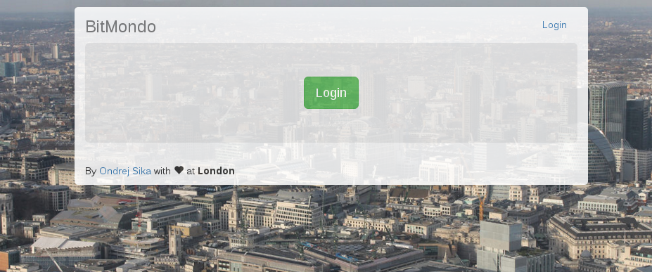
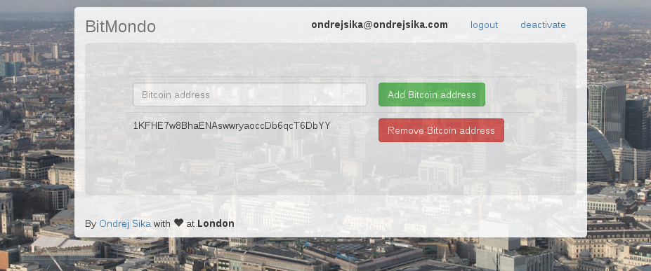

# BitMondo

Show your Bitcoin transactions at the Mondo feed

- author: Ondrej Sika <ondrej@ondrejsika.com>

## Installation

Setup base project

    git clone git@github.com:ondrejsika/bitmondo.git
    cd bitmondo
    virtualenv .env
    source .env/bin/activate
    pip install -e .
    ./manage.py migrate

Run in gunicorn

    gunicorn wsgi -b 0.0.0.0:9999

Setup cron job

    # add to your crontab
    * * * * * cd /home/projects/bitmondo && .env/bin/python manage.py mondo_cron

## Live version

It works only with my account :(

__<http://bitmondo.sikaapp.cz>__

## Screenshot

